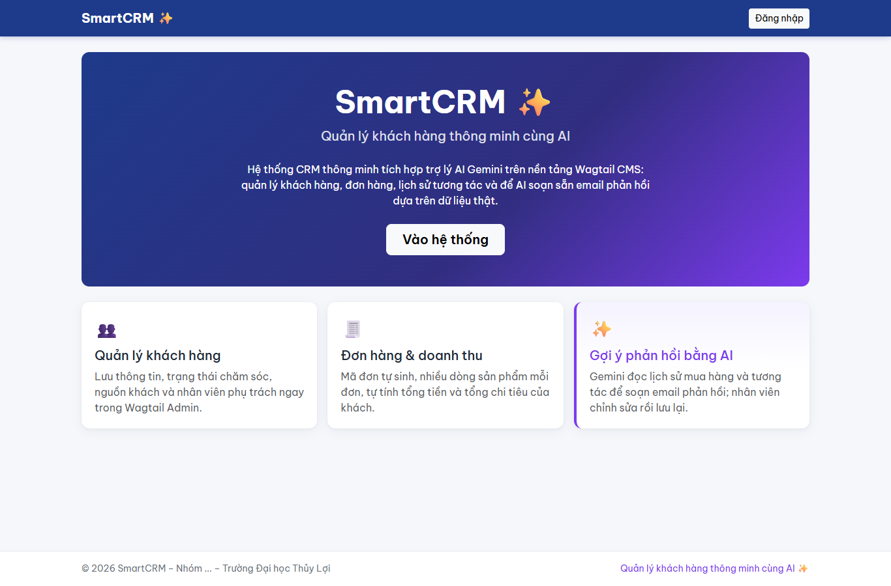
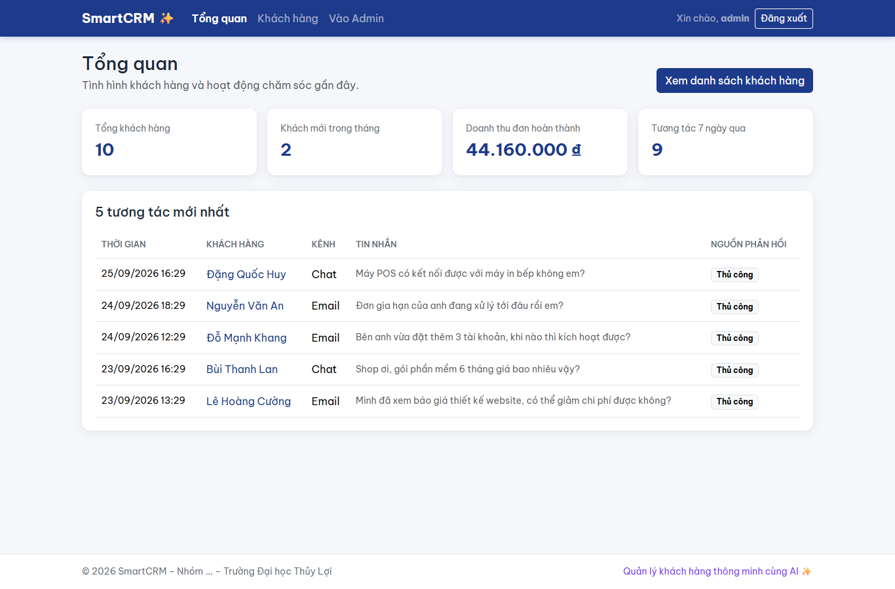
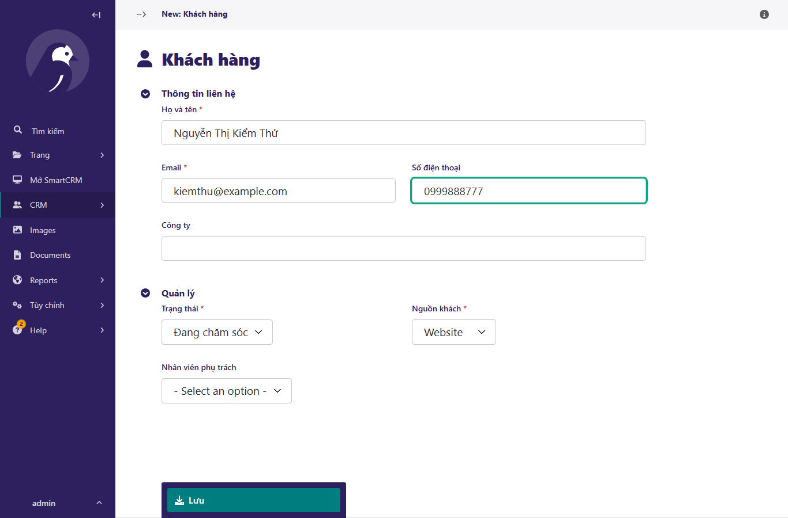
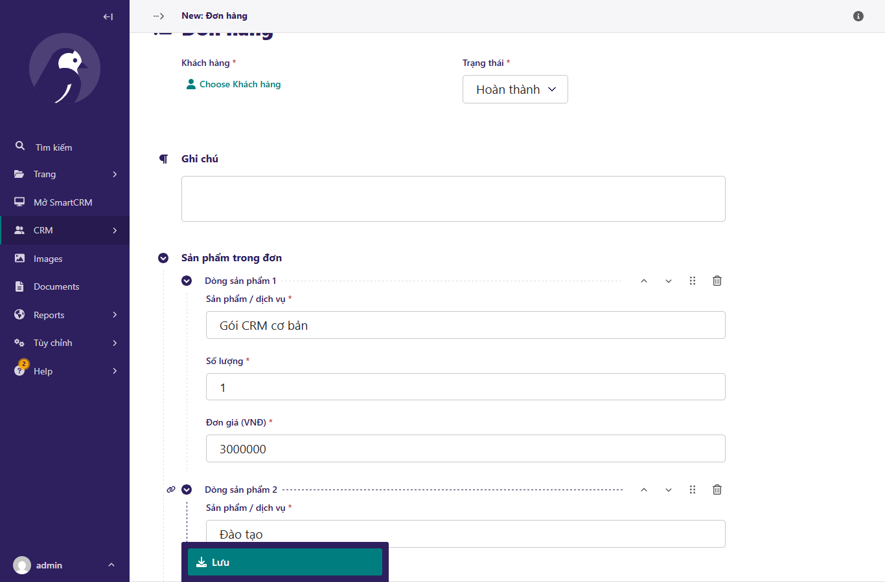
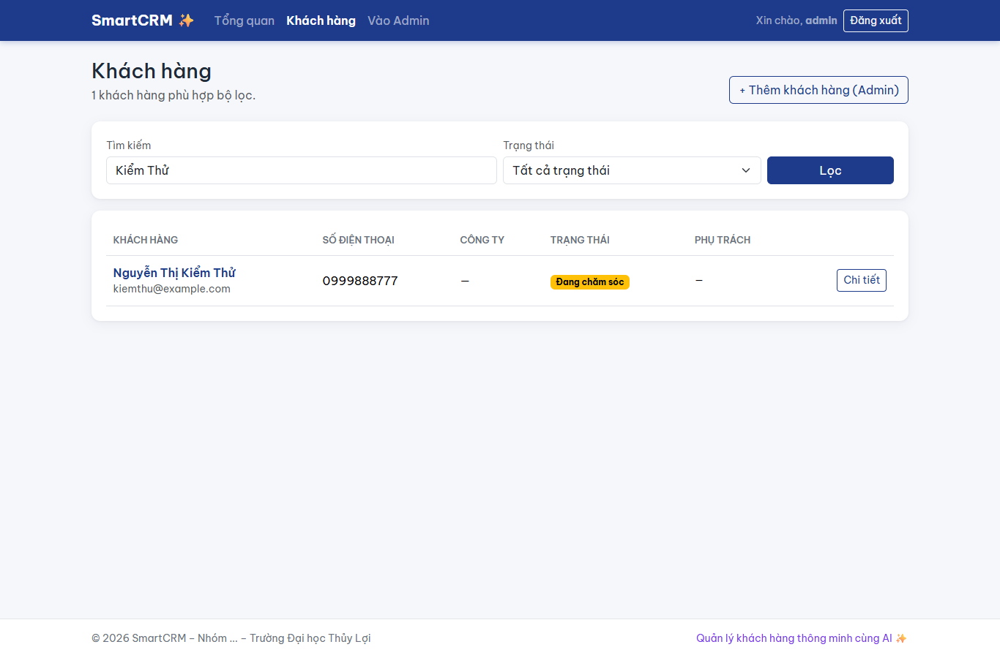
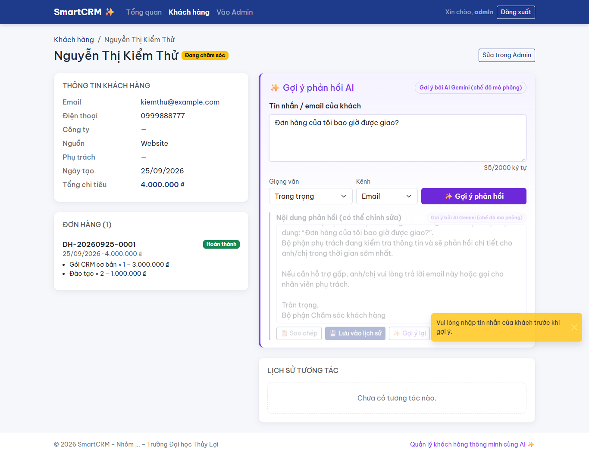
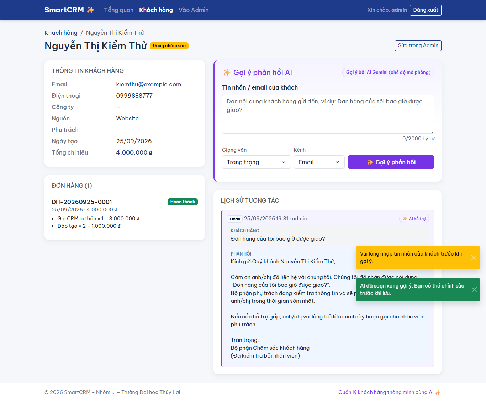
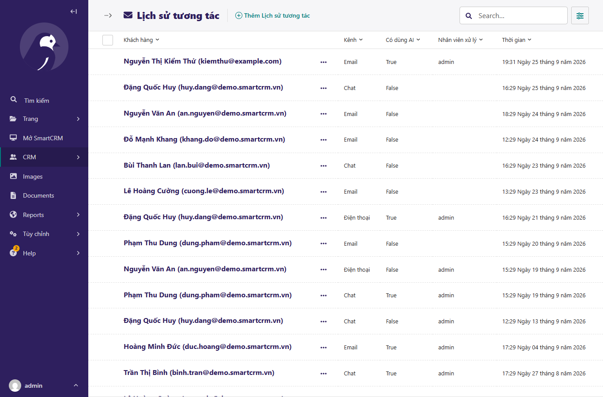
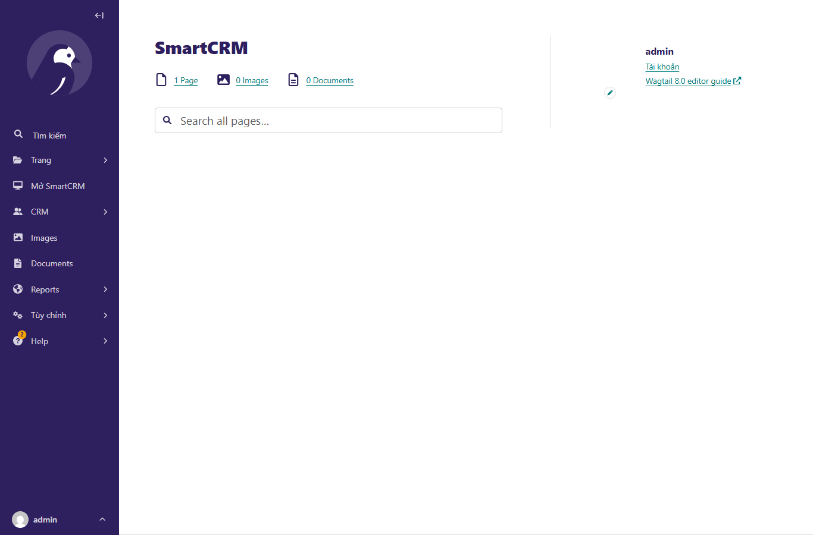
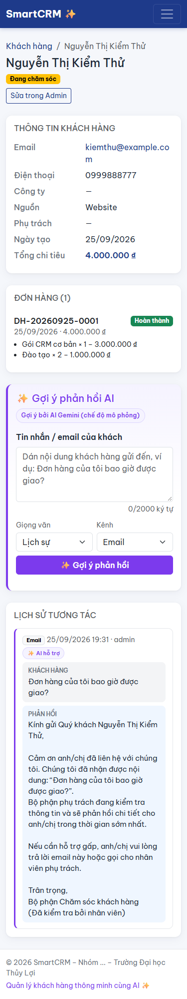

# SmartCRM ✨ – Quản lý khách hàng thông minh cùng AI

**Đề tài:** Xây dựng hệ thống CRM thông minh tích hợp trợ lý AI Gemini trên nền tảng Wagtail CMS
**Môn học:** Hệ thống kinh doanh thông minh – Trường Đại học Thủy Lợi – Nhóm ...

SmartCRM là một hệ thống CRM (quản trị quan hệ khách hàng) cơ bản xây dựng trên **Wagtail CMS**.
Nhân viên quản lý khách hàng, đơn hàng trong Wagtail Admin; khi khách gửi tin nhắn, **Google Gemini**
đọc dữ liệu thật của khách (trạng thái, tổng chi tiêu, đơn hàng, lịch sử tương tác) để **gợi ý email phản hồi**.
Nhân viên chỉnh sửa gợi ý rồi lưu lại. Bản ghi được lưu vào CSDL và xem lại được trong Admin.

## Mục lục
1. [Luồng dữ liệu](#1-luồng-dữ-liệu)
2. [Checklist 01–05 ↔ file](#2-checklist-0105--file)
3. [Yêu cầu hệ thống](#3-yêu-cầu-hệ-thống)
4. [Cài đặt từng bước](#4-cài-đặt-từng-bước)
5. [Các URL chính](#5-các-url-chính)
6. [Hướng dẫn sử dụng & kiểm thử chi tiết](#6-hướng-dẫn-sử-dụng--kiểm-thử-chi-tiết)
7. [Chạy kiểm thử](#7-chạy-kiểm-thử)
8. [Chế độ MOCK & xử lý sự cố](#8-chế-độ-mock--xử-lý-sự-cố)
9. [Bảo mật](#9-bảo-mật)
10. [Hướng dẫn mở rộng tính năng AI](#10-hướng-dẫn-mở-rộng-tính-năng-ai)
11. [Ảnh chụp màn hình](#11-ảnh-chụp-màn-hình)
12. [Cấu trúc thư mục](#12-cấu-trúc-thư-mục)

---

## 1. Luồng dữ liệu


## 2. Checklist 01–05 ↔ file

| # | Yêu cầu | Trạng thái | File / thư mục chính |
|---|---|---|---|
| 01 | Cài đặt môi trường Python và khởi tạo dự án Wagtail CMS | ✅ | `requirements.txt`, `manage.py`, `smartcrm/settings/base.py` (vi, Asia/Ho_Chi_Minh, `WAGTAIL_SITE_NAME`, đọc `.env`), `.env.example`, `.gitignore` |
| 02 | Model tùy chỉnh lưu khách hàng, đơn hàng | ✅ | `crm/models.py` (Customer, Order, OrderItem, InteractionLog), `crm/wagtail_hooks.py` (SnippetViewSet, nhóm menu "CRM", menu "Mở SmartCRM"), `crm/migrations/` |
| 03 | Tích hợp API AI – gợi ý phản hồi email | ✅ | `crm/services/ai_service.py` (`GeminiCRMService`, `AIServiceError`, `get_ai_service`) |
| 04 | Giao diện Frontend tương tác với AI | ✅ | `crm/views.py`, `crm/urls.py`, `crm/templates/crm/*.html`, `crm/static/crm/js/ai.js`, `crm/static/crm/css/smartcrm.css`, `home/templates/home/home_page.html` |
| 05 | Kiểm thử luồng & tài liệu triển khai | ✅ | `crm/tests/` (40 unit test), `crm/management/commands/seed_demo.py`, `docs/TEST_CASES.md`, `docs/screenshots/`, `README.md` |

## 3. Yêu cầu hệ thống

| Thành phần | Phiên bản |
|---|---|
| Python | ≥ 3.11 (đã kiểm thử với 3.13) |
| Wagtail | 8.0 |
| Django | 6.1.1 |
| google-genai | 2.25.0 (SDK mới của Google, **không** dùng `google-generativeai`) |
| python-dotenv | 1.2.3 |
| CSDL | SQLite (có sẵn trong Python) |
| Trình duyệt | Chrome / Edge / Firefox bản mới (có Internet để tải Bootstrap 5 và font từ CDN) |

## 4. Cài đặt từng bước

### Windows (PowerShell)

```powershell
# 1. Tải mã nguồn
git clone https://github.com/tbill111/Wagtail-CMS.git
cd Wagtail-CMS

# 2. Tạo và kích hoạt môi trường ảo
python -m venv venv
.\venv\Scripts\Activate.ps1
# Nếu bị chặn script: Set-ExecutionPolicy -Scope CurrentUser RemoteSigned

# 3. Cài thư viện
pip install -r requirements.txt

# 4. Tạo file cấu hình
copy .env.example .env
# Mở .env, dán GEMINI_API_KEY (xem mục "Lấy API key Gemini" bên dưới). Để trống thì hệ thống chạy chế độ mô phỏng.

# 5. Tạo CSDL
python manage.py migrate

# 6. Tạo tài khoản quản trị
python manage.py createsuperuser

# 7. Nạp dữ liệu mẫu (~10 khách, 12 đơn, 20 tương tác)
python manage.py seed_demo

# 8. Chạy máy chủ
python manage.py runserver
```

### macOS / Linux (bash/zsh)

```bash
git clone https://github.com/tbill111/Wagtail-CMS.git
cd Wagtail-CMS
python3 -m venv venv
source venv/bin/activate
pip install -r requirements.txt
cp .env.example .env          # rồi sửa GEMINI_API_KEY trong .env
python manage.py migrate
python manage.py createsuperuser
python manage.py seed_demo
python manage.py runserver
```

### Lấy API key Gemini (miễn phí)
1. Truy cập **Google AI Studio**: <https://aistudio.google.com/apikey> và đăng nhập tài khoản Google.
2. Bấm **Create API key** rồi sao chép key.
3. Dán vào `.env`: `GEMINI_API_KEY=<key vừa sao chép>`, giữ `GEMINI_MODEL=gemini-3.8-flash`, `AI_MOCK=False`.
4. Khởi động lại `runserver`. Nhãn "(chế độ mô phỏng)" trên trang chi tiết khách sẽ biến mất.

Các biến trong `.env`:

| Biến | Ý nghĩa | Mặc định |
|---|---|---|
| `GEMINI_API_KEY` | API key Gemini. Để trống thì chạy MOCK | *(trống)* |
| `GEMINI_MODEL` | Tên model | `gemini-3.8-flash` |
| `GEMINI_FALLBACK_MODEL` | Model dự phòng, tự dùng khi model chính quá tải (503). Để trống để tắt | `gemini-flash-latest` |
| `AI_MOCK` | `True` thì luôn dùng kết quả giả lập | `False` |
| `FALLBACK_AI_API_KEY` | *(Tuỳ chọn)* key của AI dự phòng (Groq / OpenRouter / DeepSeek…), dùng khi Gemini lỗi. Để trống để tắt | *(trống)* |
| `FALLBACK_AI_BASE_URL` | Địa chỉ API tương thích OpenAI của AI dự phòng | *(trống)* |
| `FALLBACK_AI_MODEL` | Tên model của AI dự phòng | *(trống)* |
| `FALLBACK_AI_NAME` | Tên hiển thị trên giao diện, ví dụ "Groq Llama 3.3" | `AI dự phòng` |
| `DJANGO_SECRET_KEY` | Khoá bí mật Django (bắt buộc khi chạy production) | khoá dev |
| `DEBUG` | Chế độ debug | `True` |

Lệnh `seed_demo` chạy lại nhiều lần không bị trùng dữ liệu. Muốn xoá dữ liệu mẫu và tạo lại thì chạy `python manage.py seed_demo --reset`.
Nếu tạo superuser **trước** khi seed, khách mẫu sẽ được gán cho tài khoản đó làm nhân viên phụ trách.

## 5. Các URL chính

| URL | Mô tả |
|---|---|
| <http://127.0.0.1:8000/> | Trang chủ giới thiệu SmartCRM |
| <http://127.0.0.1:8000/admin/> | Wagtail Admin, menu **CRM** (Khách hàng, Đơn hàng, Lịch sử tương tác) và **Mở SmartCRM** |
| <http://127.0.0.1:8000/crm/> | Tổng quan: 4 thẻ số liệu + 5 tương tác mới nhất |
| <http://127.0.0.1:8000/crm/customers/> | Danh sách khách: tìm theo tên/email/SĐT, lọc trạng thái, 10 khách/trang |
| `/crm/customers/<id>/` | Chi tiết khách + khối **✨ Gợi ý phản hồi AI** + timeline |
| `POST /crm/api/customers/<id>/suggest-reply/` | Vào `{message, tone}`, ra `{ok, reply, mock, provider}` (`provider` = tên AI đã trả lời) |
| `POST /crm/api/customers/<id>/save-interaction/` | Vào `{message, ai_suggested_reply, final_reply, channel}`, ra `{ok, id, interaction_html}` |

Trang `/crm/` yêu cầu đăng nhập bằng tài khoản **staff**. Mã lỗi của API: `400` dữ liệu sai, `401` chưa đăng nhập,
`403` không có quyền, `404` không có khách, `405` sai phương thức, `503` AI lỗi.

**Cách dùng nhanh:** mở một khách hàng, dán tin nhắn của khách, chọn giọng văn (lịch sự / thân thiện / trang trọng) rồi bấm
**✨ Gợi ý phản hồi**. Sau đó sửa nội dung nếu cần, bấm **Sao chép** hoặc **Lưu vào lịch sử**.

## 6. Hướng dẫn sử dụng & kiểm thử chi tiết

Mục này dành cho người lần đầu chạy SmartCRM (giảng viên chấm bài, thành viên nhóm). Làm lần lượt từ 6.1 đến 6.5.

### 6.1. Khởi động web

Mỗi lần muốn dùng web, mở terminal **tại thư mục gốc dự án** (thư mục chứa `manage.py`) và chạy:

**Windows (PowerShell)**
```powershell
.\venv\Scripts\Activate.ps1      # kích hoạt môi trường ảo, đầu dòng sẽ hiện (venv)
python manage.py runserver
```

**macOS / Linux**
```bash
source venv/bin/activate
python manage.py runserver
```

Khi terminal hiện dòng `Starting development server at http://127.0.0.1:8000/`, web đã chạy.
**Giữ nguyên cửa sổ terminal này** trong suốt quá trình sử dụng. Muốn tắt web thì bấm `Ctrl + C`.

> Nếu thư mục `venv` nằm ở chỗ khác (ví dụ thư mục cha), hãy sửa đường dẫn cho phù hợp, ví dụ `..\venv\Scripts\Activate.ps1`.
> Nếu cổng 8000 đang bị chiếm, chạy `python manage.py runserver 8080` và thay `8000` bằng `8080` trong các link bên dưới.

### 6.2. Các link cần mở

| Link | Dùng để | Cần đăng nhập? |
|---|---|---|
| <http://127.0.0.1:8000/> | Trang chủ giới thiệu SmartCRM, có nút **Vào hệ thống** | Không |
| <http://127.0.0.1:8000/admin/> | **Wagtail Admin**: nhập và quản lý dữ liệu (khách hàng, đơn hàng, lịch sử tương tác) | Có |
| <http://127.0.0.1:8000/crm/> | **SmartCRM – Tổng quan**: 4 thẻ số liệu, 5 tương tác mới nhất | Có (staff) |
| <http://127.0.0.1:8000/crm/customers/> | Danh sách khách hàng: tìm kiếm, lọc, phân trang | Có (staff) |
| `http://127.0.0.1:8000/crm/customers/<id>/` | Chi tiết một khách + khối **✨ Gợi ý phản hồi AI** | Có (staff) |

Web chỉ mở được **trên chính máy đang chạy lệnh `runserver`**, và chỉ khi terminal ở bước 6.1 vẫn đang mở.

### 6.3. Đăng nhập

1. Nếu chưa có tài khoản, tạo tài khoản quản trị (chỉ cần làm một lần):
   ```bash
   python manage.py createsuperuser
   ```
   Nhập *Username*, *Email* (có thể để trống) và *Password* hai lần. Khi gõ mật khẩu, terminal không hiển thị ký tự nào, đây là bình thường.
   Nếu Django cảnh báo mật khẩu quá ngắn hoặc quá phổ biến, bạn có thể gõ `y` để vẫn dùng mật khẩu đó (chỉ nên làm khi chạy thử trên máy cá nhân).
2. Mở <http://127.0.0.1:8000/crm/>. Vì chưa đăng nhập, web tự chuyển sang trang đăng nhập `/admin/login/`.
3. Nhập tên đăng nhập và mật khẩu vừa tạo, rồi bấm **Đăng nhập**. Web sẽ quay về trang **Tổng quan** của SmartCRM.
4. Trên thanh điều hướng có: **SmartCRM ✨ · Tổng quan · Khách hàng · Vào Admin · Đăng xuất**.
   Trong Admin, ở menu bên trái có nhóm **CRM** và mục **Mở SmartCRM** để quay lại giao diện SmartCRM.

**Lưu ý về quyền truy cập**
- Chỉ tài khoản **staff** mới vào được `/crm/`. Tài khoản tạo bằng `createsuperuser` đã là staff.
- Muốn tạo tài khoản cho nhân viên khác: vào Admin, chọn **Cài đặt → Người dùng → Thêm người dùng**, rồi bật quyền truy cập trang quản trị (hoặc cho vào nhóm *Moderators/Editors*).
- Quên mật khẩu: chạy `python manage.py changepassword <tên_đăng_nhập>`.

### 6.4. Nạp dữ liệu mẫu (khuyến nghị trước khi demo)

```bash
python manage.py seed_demo          # tạo 10 khách, 12 đơn, 20 tương tác (chạy lại nhiều lần không bị trùng)
python manage.py seed_demo --reset  # xoá dữ liệu mẫu cũ rồi tạo lại từ đầu
```
Dữ liệu mẫu dùng email đuôi `@demo.smartcrm.vn` và bao gồm đủ 4 trạng thái khách hàng (Tiềm năng, Đang chăm sóc, Đã mua hàng, Đã rời bỏ).
`--reset` chỉ xoá khách mẫu, không động đến khách bạn tự thêm.

### 6.5. Kịch bản kiểm thử luồng chính (khoảng 5 phút)

Kịch bản này kiểm tra đủ luồng **Admin → AI → Frontend → lưu vào CSDL → xem lại ở Admin**.

**Bước 1 – Thêm khách hàng trong Admin**
1. Vào <http://127.0.0.1:8000/admin/>, ở menu trái chọn **CRM → Khách hàng → Thêm Khách hàng**.
2. Nhập *Họ và tên* (ví dụ "Nguyễn Thị Kiểm Thử"), *Email* (không trùng với khách đã có), *Số điện thoại*; chọn *Trạng thái* = **Đang chăm sóc**.
3. Bấm **Lưu**. Kết quả: có thông báo lưu thành công, khách xuất hiện trong danh sách.
4. Thử tính năng của Admin: ô **Tìm kiếm** (theo tên, email, SĐT, công ty) và nút **Bộ lọc** (trạng thái, nguồn, nhân viên phụ trách).

**Bước 2 – Thêm đơn hàng có nhiều sản phẩm**
1. Chọn **CRM → Đơn hàng → Thêm Đơn hàng**.
2. Ô *Khách hàng*: bấm **Chọn Khách hàng** rồi chọn khách vừa tạo trong hộp thoại hiện ra.
3. *Trạng thái* = **Hoàn thành**. Ở mục **Sản phẩm trong đơn**, nhập tên sản phẩm, số lượng, đơn giá. Bấm **Thêm Dòng sản phẩm** để thêm dòng thứ hai.
4. Bấm **Lưu**. Kết quả: đơn có **mã tự sinh** dạng `DH-YYYYMMDD-0001`, cột tổng tiền tính đúng.

**Bước 3 – Xem khách hàng ở SmartCRM**
1. Ở menu trái của Admin, bấm **Mở SmartCRM** rồi vào **Khách hàng**, hoặc mở thẳng <http://127.0.0.1:8000/crm/customers/>.
2. Gõ tên khách vào ô tìm kiếm, bấm **Lọc**, rồi bấm **Chi tiết**.
3. Kết quả:
   - **Cột trái**: thông tin khách, badge trạng thái màu vàng, đơn hàng vừa tạo, *Tổng chi tiêu* bằng tổng các đơn **Hoàn thành**.
   - **Cột phải**: khối tím **✨ Gợi ý phản hồi AI**, và mục *Lịch sử tương tác* hiện "Chưa có tương tác nào".

**Bước 4 – Dùng AI gợi ý email phản hồi**
1. Bấm **✨ Gợi ý phản hồi** khi ô tin nhắn còn trống. Kết quả: hiện thông báo vàng "Vui lòng nhập tin nhắn…" và không gửi yêu cầu nào.
2. Nhập tin nhắn của khách, ví dụ: *"Đơn hàng của tôi bao giờ được giao?"*. Bộ đếm hiện số ký tự (tối đa 2000).
3. Chọn *Giọng văn* (Lịch sự / Thân thiện / Trang trọng) và *Kênh* (Email / Điện thoại / Chat / Trực tiếp).
4. Bấm **✨ Gợi ý phản hồi**. Kết quả:
   - Nút bị khoá, hiện vòng xoay và dòng chữ "✨ AI đang soạn…".
   - Vài giây sau, email gợi ý hiện ra trong khung viền tím, có tên khách và nhãn **"Gợi ý bởi AI Gemini"** (kèm "(chế độ mô phỏng)" nếu chưa có API key).
   - **Trang không tải lại.**
5. Bấm **✨ Gợi ý lại** nếu muốn AI soạn phiên bản khác.

**Bước 5 – Chỉnh sửa, sao chép và lưu**
1. Sửa nội dung trong ô phản hồi, ví dụ thêm một câu.
2. Bấm **📋 Sao chép**. Kết quả: thông báo "Đã sao chép…", có thể dán (Ctrl+V) vào Gmail/Word.
3. Bấm **💾 Lưu vào lịch sử**. Kết quả:
   - Thông báo xanh "Đã lưu vào lịch sử tương tác".
   - Tương tác mới xuất hiện **đầu tiên** trong *Lịch sử tương tác*, có nhãn **✨ AI hỗ trợ** và đúng nội dung **đã sửa**.
   - Các ô nhập được làm trống để soạn tin tiếp theo.

**Bước 6 – Kiểm tra dữ liệu đã lưu ngược vào Admin**
1. Bấm **Vào Admin** trên thanh điều hướng, rồi chọn **CRM → Lịch sử tương tác**.
2. Mở bản ghi mới nhất. Bản ghi có đủ: khách hàng, kênh, *Tin nhắn của khách*, *Gợi ý phản hồi của AI* (bản gốc), *Phản hồi đã gửi* (bản đã sửa), *Có dùng AI* được tích, *Nhân viên xử lý* là tài khoản đang đăng nhập.
3. Quay lại <http://127.0.0.1:8000/crm/>. Thẻ **Tương tác 7 ngày qua** tăng thêm 1, và tương tác mới nằm đầu bảng.

**Bước 7 – Các kiểm tra bổ sung**

| Kiểm tra | Cách làm | Kết quả mong đợi |
|---|---|---|
| Lọc trạng thái | `/crm/customers/`, chọn "Đã rời bỏ", bấm **Lọc** | Chỉ hiện khách có badge đỏ |
| Tìm theo SĐT | Gõ `0901234567` (khách mẫu) | Ra đúng 1 khách |
| Phân trang | Có hơn 10 khách | Mỗi trang 10 khách, chuyển trang vẫn giữ bộ lọc |
| Chặn truy cập | Bấm **Đăng xuất**, rồi mở `/crm/` | Bị chuyển về trang đăng nhập |
| Giao diện mobile | Bấm F12, chọn biểu tượng điện thoại (Ctrl+Shift+M), chọn iPhone | Bố cục 1 cột, khối AI nằm trên lịch sử, không bị tràn ngang |
| Tin nhắn quá dài | Dán hơn 2000 ký tự | Ô nhập không cho gõ thêm; API trả lỗi 400 nếu gửi trực tiếp |

Toàn bộ kịch bản kèm cột kết quả thực tế có trong [docs/TEST_CASES.md](docs/TEST_CASES.md). Ảnh minh hoạ từng bước có ở mục [Ảnh chụp màn hình](#11-ảnh-chụp-màn-hình).

### 6.6. Chuyển từ chế độ mô phỏng sang AI Gemini thật

1. Lấy API key tại <https://aistudio.google.com/apikey>.
2. Mở file `.env` ở thư mục gốc (nếu chưa có thì copy từ `.env.example`) và sửa:
   ```
   GEMINI_API_KEY=<key_của_bạn>
   GEMINI_MODEL=gemini-3.8-flash
   AI_MOCK=False
   ```
3. Tắt server (`Ctrl + C`) rồi chạy lại `python manage.py runserver`. File `.env` chỉ được đọc lúc khởi động.
4. Mở lại trang chi tiết khách. Nhãn "(chế độ mô phỏng)" biến mất, và nội dung email do Gemini soạn dựa trên đơn hàng và lịch sử của chính khách đó.
5. Khi demo mà mạng yếu hoặc hết quota, đặt `AI_MOCK=True` rồi khởi động lại server để quay về chế độ mô phỏng.

### 6.7. Dùng AI dự phòng khi Gemini lỗi (Groq, OpenRouter, DeepSeek…)

Gemini thỉnh thoảng báo **503 quá tải** hoặc hết quota. Để web vẫn trả lời được, SmartCRM hỗ trợ một **nhà cung cấp AI dự phòng**
theo chuẩn API tương thích OpenAI. Gemini vẫn là AI chính; AI dự phòng **chỉ được gọi khi Gemini lỗi**.

Thứ tự hệ thống tự thử:

```
GEMINI_MODEL  ──503──▶  GEMINI_FALLBACK_MODEL  ──lỗi──▶  FALLBACK_AI_* (Groq/OpenRouter/DeepSeek)  ──lỗi──▶  thông báo lỗi
```

Nếu **không có** `GEMINI_API_KEY` nhưng có `FALLBACK_AI_API_KEY`, hệ thống dùng thẳng AI dự phòng.
Nhãn trên kết quả cho biết AI nào đã trả lời, ví dụ "Gợi ý bởi AI Gemini" hoặc "Gợi ý bởi Groq Llama 3.3".

| Nhà cung cấp | Chi phí | Lấy key | `FALLBACK_AI_BASE_URL` | `FALLBACK_AI_MODEL` (ví dụ) |
|---|---|---|---|---|
| **Groq** (khuyên dùng) | Miễn phí, có giới hạn số lượt/phút, không cần thẻ | <https://console.groq.com/keys> | `https://api.groq.com/openai/v1` | `llama-3.3-70b-versatile` |
| **OpenRouter** | Có nhiều model miễn phí (tên kết thúc bằng `:free`), kể cả một số model DeepSeek | <https://openrouter.ai/keys> | `https://openrouter.ai/api/v1` | chọn tại <https://openrouter.ai/models?max_price=0> |
| **DeepSeek** | **Trả phí** theo lượt (rẻ), phải nạp tiền trước; hết tiền sẽ báo lỗi 402 | <https://platform.deepseek.com/api_keys> | `https://api.deepseek.com` | `deepseek-chat` |

Danh sách model miễn phí và hạn mức do các nhà cung cấp tự thay đổi. Nếu báo "Model … không tồn tại", hãy vào trang của nhà cung cấp để chọn tên model hiện có.

**Cách bật (ví dụ với Groq):**
1. Đăng ký tại <https://console.groq.com>, vào **API Keys → Create API Key**, sao chép key.
2. Mở `.env` và điền (các cấu hình mẫu đã có sẵn dưới dạng chú thích trong `.env.example`):
   ```
   FALLBACK_AI_API_KEY=<key_groq_của_bạn>
   FALLBACK_AI_BASE_URL=https://api.groq.com/openai/v1
   FALLBACK_AI_MODEL=llama-3.3-70b-versatile
   FALLBACK_AI_NAME=Groq Llama 3.3
   ```
3. Khởi động lại server (`Ctrl + C`, rồi `python manage.py runserver`).
4. Muốn thử AI dự phòng ngay mà không cần chờ Gemini lỗi: tạm xoá giá trị `GEMINI_API_KEY` trong `.env`, khởi động lại, rồi bấm **✨ Gợi ý phản hồi**. Nhãn kết quả sẽ hiện "Gợi ý bởi Groq Llama 3.3".

## 7. Chạy kiểm thử

```bash
python manage.py test crm
```

Kết quả hiện tại: **40 test – OK**. Mọi lời gọi Gemini đều được giả lập bằng `unittest.mock`, nên test **không gọi mạng** và không cần API key.
Nội dung kiểm thử: sinh mã đơn, `subtotal`, `total_amount`, `total_spent`; prompt chứa dữ liệu khách; exception → `AIServiceError`;
chế độ MOCK; chuyển sang model/nhà cung cấp AI dự phòng khi Gemini lỗi; chưa đăng nhập bị chuyển hướng; API suggest-reply 200/400/404/405/503; save-interaction tạo bản ghi; tìm kiếm/lọc/phân trang.

Kịch bản kiểm thử thủ công end-to-end (thêm khách ở Admin → AI gợi ý → lưu → xem lại ở Admin) nằm trong [docs/TEST_CASES.md](docs/TEST_CASES.md).

Kiểm tra tổng thể trước khi nộp:
```bash
python manage.py makemigrations --check
python manage.py migrate
python manage.py seed_demo
python manage.py test crm
python manage.py runserver
```

## 8. Chế độ MOCK & xử lý sự cố

**Chế độ MOCK (mô phỏng):** bật khi `GEMINI_API_KEY` trống **hoặc** `AI_MOCK=True`. Khi đó AI trả về một email mẫu
có tên khách, đúng cấu trúc như khi gọi thật. Giao diện hiện nhãn **"(chế độ mô phỏng)"**. Chế độ này dùng khi demo lúc không có
mạng hoặc khi đã hết quota.

| Hiện tượng | Nguyên nhân | Cách xử lý |
|---|---|---|
| Toast "API key Gemini không hợp lệ…" | Sai key hoặc key bị thu hồi | Tạo key mới ở Google AI Studio, sửa `.env`, khởi động lại server |
| Toast "Đã hết hạn mức (quota)…" | Vượt giới hạn miễn phí (lỗi 429) | Đợi vài phút hoặc đặt `AI_MOCK=True` để demo |
| Toast "Không tìm thấy model Gemini…" | `GEMINI_MODEL` sai hoặc model đã bị gỡ. Ví dụ `gemini-1.5-*` đã bị gỡ, còn `gemini-2.5-flash` **không còn cấp cho API key mới** (lỗi 404 "no longer available to new users") | Đặt `GEMINI_MODEL=gemini-3.8-flash` (mặc định), hoặc `gemini-flash-latest` |
| Toast "Máy chủ Gemini đang quá tải…" | Google báo 503 "high demand" cho cả model chính lẫn model dự phòng (lỗi tạm thời phía Google) | Bấm **✨ Gợi ý lại** sau vài giây; cấu hình AI dự phòng (mục 6.7); hoặc đặt `AI_MOCK=True` khi demo |
| Toast "Cả Gemini và AI dự phòng đều đang lỗi…" | Cả hai nhà cung cấp cùng lỗi; phần sau dấu `|` cho biết lý do của từng bên | Sửa theo lý do được báo (key sai, hết quota, hết số dư, sai tên model…) |
| Toast "…đã hết số dư" | Tài khoản DeepSeek hết tiền (HTTP 402) | Nạp thêm hoặc chuyển sang Groq/OpenRouter miễn phí |
| Toast "Phiên làm việc không hợp lệ (CSRF)…" / lỗi 403 | Cookie CSRF hết hạn, mở trang quá lâu, hoặc truy cập bằng domain khác | Tải lại trang (F5), đăng nhập lại; khi deploy hãy cấu hình `CSRF_TRUSTED_ORIGINS` |
| Luôn hiện "(chế độ mô phỏng)" dù đã có key | Chưa khởi động lại server hoặc `AI_MOCK=True` | Kiểm tra `.env` rồi khởi động lại `runserver` |
| Giao diện không có kiểu dáng | Máy không có Internet để tải Bootstrap/font từ CDN | Kết nối mạng |
| `/crm/` chuyển về trang đăng nhập | Tài khoản không phải staff | Dùng tài khoản tạo bằng `createsuperuser` hoặc bật "Quyền quản trị" cho user |

Log lỗi AI được in ra console của `runserver` (logger `crm`). Log chỉ ghi loại lỗi và tên model, **không bao giờ ghi API key**.

## 9. Bảo mật

- **Không commit file `.env`**, vì file này đã có trong `.gitignore`. Chỉ commit `.env.example` với giá trị để trống.
- API key chỉ được đọc từ biến môi trường, không có trong mã nguồn. Log và thông báo lỗi không chứa key.
- Frontend `/crm/` và mọi API chỉ dành cho tài khoản **staff** đã đăng nhập. API chỉ nhận `POST` và có kiểm tra CSRF.
- Dữ liệu đầu vào được kiểm tra: không nhận tin nhắn rỗng, tối đa 2000 ký tự, giọng văn và kênh phải thuộc danh sách cho phép.
- Nội dung do AI hoặc người dùng tạo đều được escape khi hiển thị (Django template / `textContent`).
- Khi triển khai thật: dùng `smartcrm.settings.production`, đặt `DJANGO_SECRET_KEY`, `ALLOWED_HOSTS`, `DEBUG=False`.
- Nếu lỡ commit key, hãy **thu hồi key ngay** trong Google AI Studio rồi tạo key mới.

## 10. Hướng dẫn mở rộng tính năng AI

Code được tách lớp để có thể thêm tính năng AI mới (ví dụ *Phân loại khách hàng*, *Báo cáo nhận định*) mà không phải sửa lại phần đã có.

**Bước 1 – Thêm method vào service** (`crm/services/ai_service.py`)
```python
def classify_customer(self, customer):
    if self.is_mock:
        return {"segment": "Tiềm năng cao", "reason": "(mô phỏng)"}
    schema = {"type": "OBJECT", "properties": {
        "segment": {"type": "STRING"}, "reason": {"type": "STRING"}}, "required": ["segment", "reason"]}
    prompt = f"Phân loại khách hàng sau...\n\n{self.build_customer_context(customer)}"
    return json.loads(self._generate(prompt, json_schema=schema))
```
Dùng lại `build_customer_context()` để lấy dữ liệu khách và `_generate()` để gọi Gemini. `_generate()` đã lo phần JSON schema, bắt lỗi và ghi log.
Nếu cần lưu kết quả vào `Customer`, hãy thêm trường `ai_*` bằng **migration mới** (`makemigrations crm`).

**Bước 2 – Thêm view + URL API** (`crm/views.py`, `crm/urls.py`)
```python
@require_POST
@api_staff_required
def api_classify_customer(request, pk):
    customer = Customer.objects.filter(pk=pk).first()
    if customer is None:
        return json_error("Không tìm thấy khách hàng.", 404)
    try:
        result = get_ai_service().classify_customer(customer)
    except AIServiceError as exc:
        return json_error(str(exc), 503)
    return JsonResponse({"ok": True, "result": result, "mock": get_ai_service().is_mock})
```
Thêm vào `urls.py`: `path("api/customers/<int:pk>/classify/", views.api_classify_customer, name="api_classify_customer")`.

**Bước 3 – Thêm UI** dùng các thành phần có sẵn:
- Đặt khối mới trong `<div id="ai-extra-panels">` (hoặc override ``) của `customer_detail.html`. Vùng này nằm phía trên khối Gợi ý phản hồi.
- Dùng class `.sc-card .ai-card`, nút `.btn-ai`, nhãn `.ai-badge` để giữ màu tím ✨ đồng bộ.
- JS dùng helper có sẵn trong `ai.js`: `postJSON(url, data)`, `setLoading(button, true, "✨ AI đang phân tích…")`, `showToast(msg, "success" | "danger")`.
- Muốn thêm menu trên navbar thì override `` trong `crm/base.html`.

**Bước 4 – Thêm test giả lập** (`crm/tests/`)
- Service: `mock.patch.object(GeminiCRMService, "client", new_callable=mock.PropertyMock, return_value=fake_client('{"segment": "..."}'))`.
- View: `mock.patch.object(GeminiCRMService, "classify_customer", return_value={...})` và `side_effect=AIServiceError(...)` để kiểm tra lỗi 503.
- Chạy `python manage.py test crm` và bảo đảm không test nào gọi mạng.

## 11. Ảnh chụp màn hình

Ảnh nằm trong [docs/screenshots/](docs/screenshots/), được chụp tự động trong lúc kiểm thử end-to-end ở chế độ mô phỏng.

| Màn hình | Ảnh |
|---|---|
| Trang chủ |  |
| Tổng quan |  |
| Admin – thêm khách hàng |  |
| Admin – đơn hàng với dòng sản phẩm inline |  |
| Danh sách khách hàng |  |
| AI gợi ý phản hồi |  |
| Sau khi lưu vào lịch sử |  |
| Admin – Lịch sử tương tác |  |
| Admin – menu CRM & Mở SmartCRM |  |
| Giao diện mobile |  |

## 12. Cấu trúc thư mục

```
smartcrm/                      (gốc repo)
├── smartcrm/                  # settings (base/dev/production), urls, templates lỗi
├── home/                      # HomePage Wagtail – trang giới thiệu SmartCRM
├── crm/
│   ├── models.py              # Customer, Order, OrderItem, InteractionLog
│   ├── wagtail_hooks.py       # Snippet ViewSet + nhóm menu "CRM" + "Mở SmartCRM"
│   ├── services/ai_service.py # GeminiCRMService (google-genai) + MOCK
│   ├── views.py, urls.py      # trang /crm/ và API AJAX
│   ├── templatetags/crm_tags.py
│   ├── management/commands/seed_demo.py
│   ├── templates/crm/         # base, dashboard, customer_list, customer_detail, _interaction_item
│   ├── static/crm/            # css/smartcrm.css, js/ai.js, favicon.svg
│   └── tests/                 # test_models, test_ai_service, test_views
├── docs/                      # TEST_CASES.md, screenshots/
├── .env.example
├── .gitignore
├── requirements.txt
└── README.md
```

---
© 2026 SmartCRM – Nhóm ... – Trường Đại học Thủy Lợi
