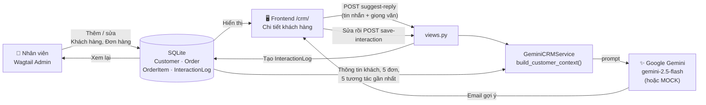

# SmartCRM ✨ – Quản lý khách hàng thông minh cùng AI

**Đề tài:** Xây dựng hệ thống CRM thông minh tích hợp trợ lý AI Gemini trên nền tảng Wagtail CMS
**Môn học:** Hệ thống kinh doanh thông minh – Trường Đại học Thủy Lợi – Nhóm ...

SmartCRM là một hệ thống CRM (quản trị quan hệ khách hàng) cơ bản xây dựng trên **Wagtail CMS**.
Nhân viên quản lý khách hàng, đơn hàng trong Wagtail Admin; khi khách gửi tin nhắn, **Google Gemini**
đọc dữ liệu thật của khách (trạng thái, tổng chi tiêu, đơn hàng, lịch sử tương tác) để **gợi ý email phản hồi**.
Nhân viên chỉnh sửa gợi ý rồi lưu lại. Bản ghi được lưu vào CSDL và xem lại được trong Admin.

## Mục lục
1. [Luồng dữ liệu](#1-luồng-dữ-liệu)
2. [Checklist 01–05 ↔ file](#2-checklist-0105--file)
3. [Yêu cầu hệ thống](#3-yêu-cầu-hệ-thống)
4. [Cài đặt từng bước](#4-cài-đặt-từng-bước)
5. [Các URL chính](#5-các-url-chính)
6. [Chạy kiểm thử](#6-chạy-kiểm-thử)
7. [Chế độ MOCK & xử lý sự cố](#7-chế-độ-mock--xử-lý-sự-cố)
8. [Bảo mật](#8-bảo-mật)
9. [Hướng dẫn mở rộng tính năng AI](#9-hướng-dẫn-mở-rộng-tính-năng-ai)
10. [Ảnh chụp màn hình](#10-ảnh-chụp-màn-hình)
11. [Cấu trúc thư mục](#11-cấu-trúc-thư-mục)

---

## 1. Luồng dữ liệu



## 2. Checklist 01–05 ↔ file

| # | Yêu cầu | Trạng thái | File / thư mục chính |
|---|---|---|---|
| 01 | Cài đặt môi trường Python và khởi tạo dự án Wagtail CMS | ✅ | `requirements.txt`, `manage.py`, `smartcrm/settings/base.py` (vi, Asia/Ho_Chi_Minh, `WAGTAIL_SITE_NAME`, đọc `.env`), `.env.example`, `.gitignore` |
| 02 | Model tùy chỉnh lưu khách hàng, đơn hàng | ✅ | `crm/models.py` (Customer, Order, OrderItem, InteractionLog), `crm/wagtail_hooks.py` (SnippetViewSet, nhóm menu "CRM", menu "Mở SmartCRM"), `crm/migrations/` |
| 03 | Tích hợp API AI – gợi ý phản hồi email | ✅ | `crm/services/ai_service.py` (`GeminiCRMService`, `AIServiceError`, `get_ai_service`) |
| 04 | Giao diện Frontend tương tác với AI | ✅ | `crm/views.py`, `crm/urls.py`, `crm/templates/crm/*.html`, `crm/static/crm/js/ai.js`, `crm/static/crm/css/smartcrm.css`, `home/templates/home/home_page.html` |
| 05 | Kiểm thử luồng & tài liệu triển khai | ✅ | `crm/tests/` (32 unit test), `crm/management/commands/seed_demo.py`, `docs/TEST_CASES.md`, `docs/screenshots/`, `README.md` |

## 3. Yêu cầu hệ thống

| Thành phần | Phiên bản |
|---|---|
| Python | ≥ 3.11 (đã kiểm thử với 3.13) |
| Wagtail | 8.0 |
| Django | 6.1.1 |
| google-genai | 2.25.0 (SDK mới của Google, **không** dùng `google-generativeai`) |
| python-dotenv | 1.2.3 |
| CSDL | SQLite (có sẵn trong Python) |
| Trình duyệt | Chrome / Edge / Firefox bản mới (có Internet để tải Bootstrap 5 và font từ CDN) |

## 4. Cài đặt từng bước

### Windows (PowerShell)

```powershell
# 1. Tải mã nguồn
git clone https://github.com/tbill111/Wagtail-CMS.git
cd Wagtail-CMS

# 2. Tạo và kích hoạt môi trường ảo
python -m venv venv
.\venv\Scripts\Activate.ps1
# Nếu bị chặn script: Set-ExecutionPolicy -Scope CurrentUser RemoteSigned

# 3. Cài thư viện
pip install -r requirements.txt

# 4. Tạo file cấu hình
copy .env.example .env
# Mở .env, dán GEMINI_API_KEY (xem bước 5). Để trống thì hệ thống chạy chế độ mô phỏng.

# 6. Tạo CSDL
python manage.py migrate

# 7. Tạo tài khoản quản trị
python manage.py createsuperuser

# 8. Nạp dữ liệu mẫu (~10 khách, 12 đơn, 20 tương tác)
python manage.py seed_demo

# 9. Chạy máy chủ
python manage.py runserver
```

### macOS / Linux (bash/zsh)

```bash
git clone https://github.com/tbill111/Wagtail-CMS.git
cd Wagtail-CMS
python3 -m venv venv
source venv/bin/activate
pip install -r requirements.txt
cp .env.example .env          # rồi sửa GEMINI_API_KEY trong .env
python manage.py migrate
python manage.py createsuperuser
python manage.py seed_demo
python manage.py runserver
```

### 5. Lấy API key Gemini (miễn phí)
1. Truy cập **Google AI Studio**: <https://aistudio.google.com/apikey> và đăng nhập tài khoản Google.
2. Bấm **Create API key** rồi sao chép key.
3. Dán vào `.env`: `GEMINI_API_KEY=AIza...`, giữ `GEMINI_MODEL=gemini-2.5-flash`, `AI_MOCK=False`.
4. Khởi động lại `runserver`. Nhãn "(chế độ mô phỏng)" trên trang chi tiết khách sẽ biến mất.

Các biến trong `.env`:

| Biến | Ý nghĩa | Mặc định |
|---|---|---|
| `GEMINI_API_KEY` | API key Gemini. Để trống thì chạy MOCK | *(trống)* |
| `GEMINI_MODEL` | Tên model | `gemini-2.5-flash` |
| `AI_MOCK` | `True` thì luôn dùng kết quả giả lập | `False` |
| `DJANGO_SECRET_KEY` | Khoá bí mật Django (bắt buộc khi chạy production) | khoá dev |
| `DEBUG` | Chế độ debug | `True` |

Lệnh `seed_demo` chạy lại nhiều lần không bị trùng dữ liệu. Muốn xoá dữ liệu mẫu và tạo lại thì chạy `python manage.py seed_demo --reset`.
Nếu tạo superuser **trước** khi seed, khách mẫu sẽ được gán cho tài khoản đó làm nhân viên phụ trách.

## 5. Các URL chính

| URL | Mô tả |
|---|---|
| <http://127.0.0.1:8000/> | Trang chủ giới thiệu SmartCRM |
| <http://127.0.0.1:8000/admin/> | Wagtail Admin, menu **CRM** (Khách hàng, Đơn hàng, Lịch sử tương tác) và **Mở SmartCRM** |
| <http://127.0.0.1:8000/crm/> | Tổng quan: 4 thẻ số liệu + 5 tương tác mới nhất |
| <http://127.0.0.1:8000/crm/customers/> | Danh sách khách: tìm theo tên/email/SĐT, lọc trạng thái, 10 khách/trang |
| `/crm/customers/<id>/` | Chi tiết khách + khối **✨ Gợi ý phản hồi AI** + timeline |
| `POST /crm/api/customers/<id>/suggest-reply/` | Vào `{message, tone}`, ra `{ok, reply, mock}` |
| `POST /crm/api/customers/<id>/save-interaction/` | Vào `{message, ai_suggested_reply, final_reply, channel}`, ra `{ok, id, interaction_html}` |

Trang `/crm/` yêu cầu đăng nhập bằng tài khoản **staff**. Mã lỗi của API: `400` dữ liệu sai, `401` chưa đăng nhập,
`403` không có quyền, `404` không có khách, `405` sai phương thức, `503` AI lỗi.

**Cách dùng nhanh:** mở một khách hàng, dán tin nhắn của khách, chọn giọng văn (lịch sự / thân thiện / trang trọng) rồi bấm
**✨ Gợi ý phản hồi**. Sau đó sửa nội dung nếu cần, bấm **Sao chép** hoặc **Lưu vào lịch sử**.

## 6. Chạy kiểm thử

```bash
python manage.py test crm
```

Kết quả hiện tại: **32 test – OK**. Mọi lời gọi Gemini đều được giả lập bằng `unittest.mock`, nên test **không gọi mạng** và không cần API key.
Nội dung kiểm thử: sinh mã đơn, `subtotal`, `total_amount`, `total_spent`; prompt chứa dữ liệu khách; exception → `AIServiceError`;
chế độ MOCK; chưa đăng nhập bị chuyển hướng; API suggest-reply 200/400/404/405/503; save-interaction tạo bản ghi; tìm kiếm/lọc/phân trang.

Kịch bản kiểm thử thủ công end-to-end (thêm khách ở Admin → AI gợi ý → lưu → xem lại ở Admin) nằm trong [docs/TEST_CASES.md](docs/TEST_CASES.md).

Kiểm tra tổng thể trước khi nộp:
```bash
python manage.py makemigrations --check
python manage.py migrate
python manage.py seed_demo
python manage.py test crm
python manage.py runserver
```

## 7. Chế độ MOCK & xử lý sự cố

**Chế độ MOCK (mô phỏng):** bật khi `GEMINI_API_KEY` trống **hoặc** `AI_MOCK=True`. Khi đó AI trả về một email mẫu
có tên khách, đúng cấu trúc như khi gọi thật. Giao diện hiện nhãn **"(chế độ mô phỏng)"**. Chế độ này dùng khi demo lúc không có
mạng hoặc khi đã hết quota.

| Hiện tượng | Nguyên nhân | Cách xử lý |
|---|---|---|
| Toast "API key Gemini không hợp lệ…" | Sai key hoặc key bị thu hồi | Tạo key mới ở Google AI Studio, sửa `.env`, khởi động lại server |
| Toast "Đã hết hạn mức (quota)…" | Vượt giới hạn miễn phí (lỗi 429) | Đợi vài phút hoặc đặt `AI_MOCK=True` để demo |
| Toast "Không tìm thấy model Gemini…" | `GEMINI_MODEL` sai hoặc model đã bị gỡ (ví dụ `gemini-1.5-*`) | Đặt `GEMINI_MODEL=gemini-2.5-flash` |
| Toast "Phiên làm việc không hợp lệ (CSRF)…" / lỗi 403 | Cookie CSRF hết hạn, mở trang quá lâu, hoặc truy cập bằng domain khác | Tải lại trang (F5), đăng nhập lại; khi deploy hãy cấu hình `CSRF_TRUSTED_ORIGINS` |
| Luôn hiện "(chế độ mô phỏng)" dù đã có key | Chưa khởi động lại server hoặc `AI_MOCK=True` | Kiểm tra `.env` rồi khởi động lại `runserver` |
| Giao diện không có kiểu dáng | Máy không có Internet để tải Bootstrap/font từ CDN | Kết nối mạng |
| `/crm/` chuyển về trang đăng nhập | Tài khoản không phải staff | Dùng tài khoản tạo bằng `createsuperuser` hoặc bật "Quyền quản trị" cho user |

Log lỗi AI được in ra console của `runserver` (logger `crm`). Log chỉ ghi loại lỗi và tên model, **không bao giờ ghi API key**.

## 8. Bảo mật

- **Không commit file `.env`**, vì file này đã có trong `.gitignore`. Chỉ commit `.env.example` với giá trị để trống.
- API key chỉ được đọc từ biến môi trường, không có trong mã nguồn. Log và thông báo lỗi không chứa key.
- Frontend `/crm/` và mọi API chỉ dành cho tài khoản **staff** đã đăng nhập. API chỉ nhận `POST` và có kiểm tra CSRF.
- Dữ liệu đầu vào được kiểm tra: không nhận tin nhắn rỗng, tối đa 2000 ký tự, giọng văn và kênh phải thuộc danh sách cho phép.
- Nội dung do AI hoặc người dùng tạo đều được escape khi hiển thị (Django template / `textContent`).
- Khi triển khai thật: dùng `smartcrm.settings.production`, đặt `DJANGO_SECRET_KEY`, `ALLOWED_HOSTS`, `DEBUG=False`.
- Nếu lỡ commit key, hãy **thu hồi key ngay** trong Google AI Studio rồi tạo key mới.

## 9. Hướng dẫn mở rộng tính năng AI

Code được tách lớp để có thể thêm tính năng AI mới (ví dụ *Phân loại khách hàng*, *Báo cáo nhận định*) mà không phải sửa lại phần đã có.

**Bước 1 – Thêm method vào service** (`crm/services/ai_service.py`)
```python
def classify_customer(self, customer):
    if self.is_mock:
        return {"segment": "Tiềm năng cao", "reason": "(mô phỏng)"}
    schema = {"type": "OBJECT", "properties": {
        "segment": {"type": "STRING"}, "reason": {"type": "STRING"}}, "required": ["segment", "reason"]}
    prompt = f"Phân loại khách hàng sau...\n\n{self.build_customer_context(customer)}"
    return json.loads(self._generate(prompt, json_schema=schema))
```
Dùng lại `build_customer_context()` để lấy dữ liệu khách và `_generate()` để gọi Gemini. `_generate()` đã lo phần JSON schema, bắt lỗi và ghi log.
Nếu cần lưu kết quả vào `Customer`, hãy thêm trường `ai_*` bằng **migration mới** (`makemigrations crm`).

**Bước 2 – Thêm view + URL API** (`crm/views.py`, `crm/urls.py`)
```python
@require_POST
@api_staff_required
def api_classify_customer(request, pk):
    customer = Customer.objects.filter(pk=pk).first()
    if customer is None:
        return json_error("Không tìm thấy khách hàng.", 404)
    try:
        result = get_ai_service().classify_customer(customer)
    except AIServiceError as exc:
        return json_error(str(exc), 503)
    return JsonResponse({"ok": True, "result": result, "mock": get_ai_service().is_mock})
```
Thêm vào `urls.py`: `path("api/customers/<int:pk>/classify/", views.api_classify_customer, name="api_classify_customer")`.

**Bước 3 – Thêm UI** dùng các thành phần có sẵn:
- Đặt khối mới trong `<div id="ai-extra-panels">` (hoặc override ``) của `customer_detail.html`. Vùng này nằm phía trên khối Gợi ý phản hồi.
- Dùng class `.sc-card .ai-card`, nút `.btn-ai`, nhãn `.ai-badge` để giữ màu tím ✨ đồng bộ.
- JS dùng helper có sẵn trong `ai.js`: `postJSON(url, data)`, `setLoading(button, true, "✨ AI đang phân tích…")`, `showToast(msg, "success" | "danger")`.
- Muốn thêm menu trên navbar thì override `` trong `crm/base.html`.

**Bước 4 – Thêm test giả lập** (`crm/tests/`)
- Service: `mock.patch.object(GeminiCRMService, "client", new_callable=mock.PropertyMock, return_value=fake_client('{"segment": "..."}'))`.
- View: `mock.patch.object(GeminiCRMService, "classify_customer", return_value={...})` và `side_effect=AIServiceError(...)` để kiểm tra lỗi 503.
- Chạy `python manage.py test crm` và bảo đảm không test nào gọi mạng.

## 10. Ảnh chụp màn hình

Ảnh nằm trong [docs/screenshots/](docs/screenshots/), được chụp tự động trong lúc kiểm thử end-to-end ở chế độ mô phỏng.

| Màn hình | Ảnh |
|---|---|
| Trang chủ |  |
| Tổng quan |  |
| Admin – thêm khách hàng |  |
| Admin – đơn hàng với dòng sản phẩm inline |  |
| Danh sách khách hàng |  |
| AI gợi ý phản hồi |  |
| Sau khi lưu vào lịch sử |  |
| Admin – Lịch sử tương tác |  |
| Admin – menu CRM & Mở SmartCRM |  |
| Giao diện mobile |  |

## 11. Cấu trúc thư mục

```
smartcrm/                      (gốc repo)
├── smartcrm/                  # settings (base/dev/production), urls, templates lỗi
├── home/                      # HomePage Wagtail – trang giới thiệu SmartCRM
├── crm/
│   ├── models.py              # Customer, Order, OrderItem, InteractionLog
│   ├── wagtail_hooks.py       # Snippet ViewSet + nhóm menu "CRM" + "Mở SmartCRM"
│   ├── services/ai_service.py # GeminiCRMService (google-genai) + MOCK
│   ├── views.py, urls.py      # trang /crm/ và API AJAX
│   ├── templatetags/crm_tags.py
│   ├── management/commands/seed_demo.py
│   ├── templates/crm/         # base, dashboard, customer_list, customer_detail, _interaction_item
│   ├── static/crm/            # css/smartcrm.css, js/ai.js, favicon.svg
│   └── tests/                 # test_models, test_ai_service, test_views
├── docs/                      # TEST_CASES.md, screenshots/
├── .env.example
├── .gitignore
├── requirements.txt
└── README.md
```

---
© 2026 SmartCRM – Nhóm ... – Trường Đại học Thủy Lợi
